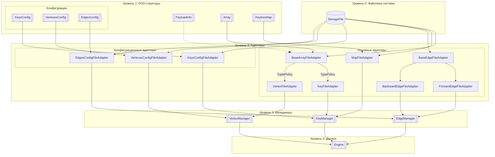
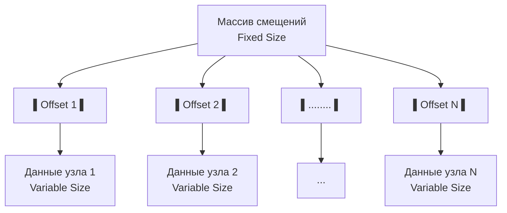
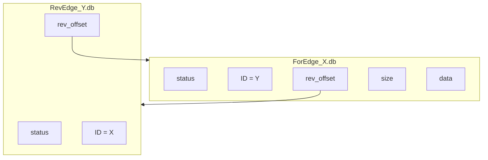
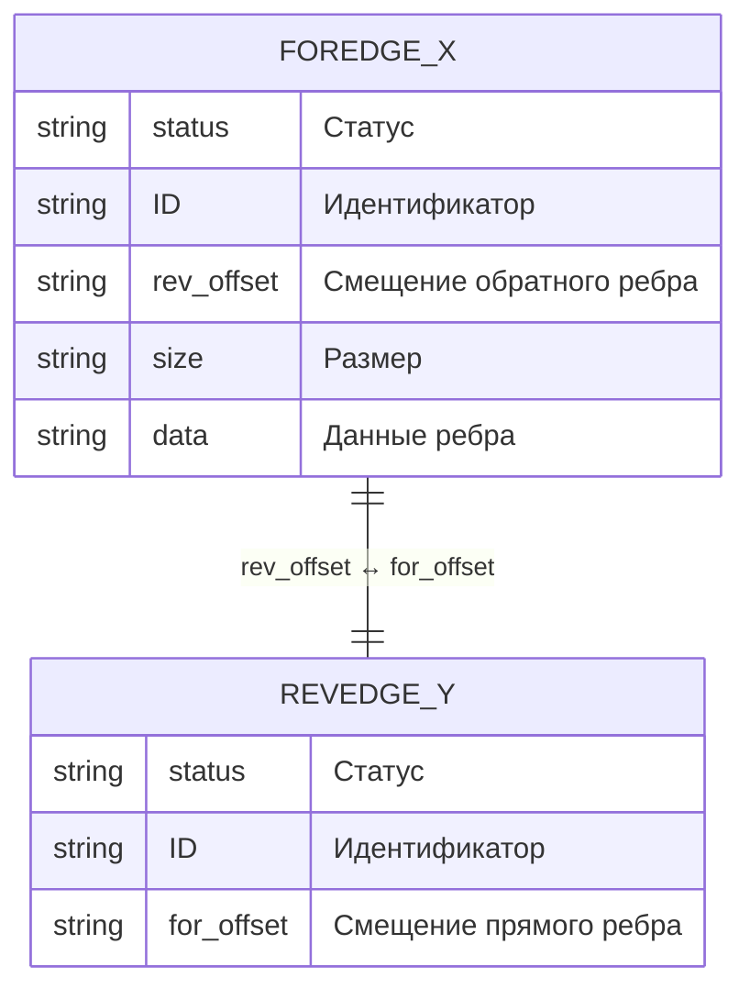
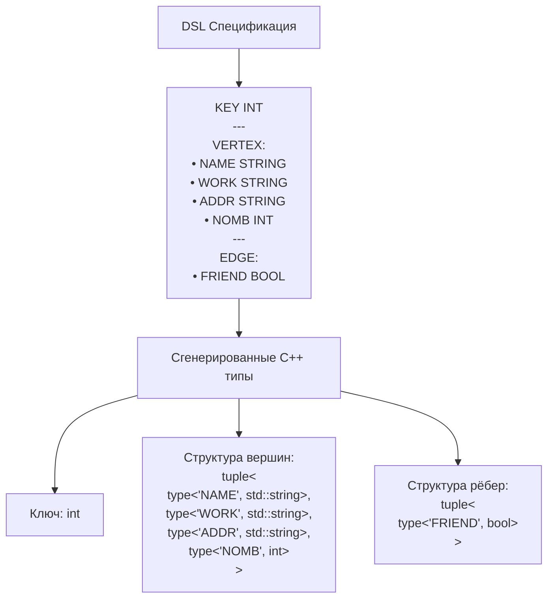

## Структура файлов графа
| Путь                    | Тип       | Содержимое                                                                 |
|-------------------------|-----------|----------------------------------------------------------------------------|
| `/` (имя графа)         |           |                                                                            |
| ├─ `graph.cpp`          | Код       | Сгенерированные типы (NamedType) + вызовы Engine API                       |
| ├─ `graph.out`          | Бинарник  | Скомпилированный движок                                                    |
| ├─ `KeyConfig.cfg`      | Конфиг    | Вспомогательная информация                                                 |
| ├─ `VertexesConfig.cfg` | Конфиг    | Вспомогательная информация                                                 |
| ├─ `EdgesConfig.cfg`    | Конфиг    | Вспомогательная информация                                                 |
| ├─ `maps/`              | Папка     |                                                                            |
| │  └─ `map_<id>.db`     | Данные    | Сериализованные ключи                                                      |
| ├─ `keys/`              | Папка     |                                                                            |
| │  └─ `key_<id>.db`     | Данные    | Сериализованные ключи                                                      |
| ├─ `vertexes/`          | Папка     |                                                                            |
| │  └─ `vertex_<id>.db`  | Данные    | Сериализованные узлы                                                       |
| ├─ `edges/`             | Папка     |                                                                            |
| │  ├─ `for_edge_<X>.db` | Данные    | Сериализованные ребра                                                      |
| │  └─ `rev_edge_<Y>.db` | Данные    | Вспомогательное информация                                                 |

## Уровни абстракции движка

## Структура ключей
### Двустороннее отображение Key ⇄ ID

Система использует специализированную хэш-таблицу для преобразования пользовательских ключей во внутренние идентификаторы:

**Key → ID**: Keyless hash-таблица с открытой адресацией
- **Keyless архитектура** - таблица хранит только значения, ключи передаются в операции (специальным образом)
- **Квадратичное пробирование** - оптимизированный алгоритм разрешения коллизий
- **Внешние предикаты** - сравнение ключей через передаваемые функции
- **Проверенная эффективность** - показала лучшую производительность в сравнении с другими методами

**ID → Key**: Массив сериализованных ключей  
- **Прямой доступ по индексу** - мгновенное получение ключа по ID
- **Дополнительная гибкость** - расширяет возможности работы с ключами
- **Сериализованное хранение** - компактное представление данных

**Архитектурные преимущества:**
- **Оптимальная производительность** - сочетание быстрого хэширования и прямого доступа
- **Экономное использование памяти** - keyless подход снижает накладные расходы
- **Полная двунаправленность** - эффективное преобразование в обе стороны


## 🏗 Структура узлов

### Организация хранения данных вершин

Система использует эффективную схему хранения данных узлов с разделением метаданных и содержимого:



**Ключевые особенности**:
- **Прямая адресация** - смещения указывают на точное расположение данных
- **Компактные метаданные** - массив смещений имеет фиксированный размер
- **Быстрый доступ** - прямое чтение данных без промежуточных поисков
- **Переменный размер данных** - каждый узел может хранить разный объём информации

**Преимущества подхода**:
- **Мгновенный доступ** - O(1) время доступа к данным узла по ID
- **Гибкость хранения** - поддержка узлов с различным размером данных
- **Эффективное использование памяти** - минимальные накладные расходы
- **Целостность данных** - чёткое разделение структуры и содержимого

## Структура рёбер
### Организация хранения графовых связей





**Ключевые особенности**:
- **Взаимные ссылки** - прямое и обратное рёбра знают о существовании друг друга
- **Раздельное хранение** - прямые и обратные рёбра в разных файлах
- **Точное позиционирование** - offset'ы указывают на точное расположение в файлах
- **Автоматическая целостность** - удаление узла автоматически обрабатывает все связанные рёбра

**Преимущества архитектуры**:
- **Быстрое удаление узлов** - мгновенное нахождение всех входящих/исходящих рёбер
- **Эффективный обход графа** - прямое получение соседей в обе стороны
- **Оптимизированное хранение** - обратные рёбра хранят только ссылочную информацию
- **Масштабируемость** - возможность добавления дополнительных индексов для больших графов

Примечание: Для графов с очень большим количеством рёбер будет предусмотрена возможность добавления дополнительных мап рёбер для оптимизации операций модификации.

## Формат типов
### Система типов и схема данных

Графовая база данных поддерживает гибкую систему типов с возможностью определения пользовательских схем данных:



**Поддерживаемые базовые типы**:
- **Ключи**: int, bool, string
- **Значения**: любые комбинации базовых типов в структурах

**Ключевые особенности системы типов**:
**Универсальная/Масштабируемая сериализация**:

- Для любого кастомного типа можно специализировать сериализацию:
```cpp
template <typename BufferType>
struct SerializeHelper<ValueType, BufferType> {
  static void serialize(BufferType& dst, const ValueType& value) {...}
  static void deserialize(BufferType& src, ValueType& value) {...}
};
```
- Любой POD тип можно добавить в список поддерживаемых в конфиге, если это необходимо т.к. сериализация универсальна:
```cpp
template <typename ValueType, typename BufferType>
struct SerializeHelper {
  static void serialize(BufferType& dst, const ValueType& value) {
    dst.write(reinterpret_cast<const char*>(&value), sizeof(ValueType));
  }
  static void deserialize(BufferType& src, ValueType& value) {
    src.read(reinterpret_cast<char*>(&value), sizeof(ValueType));
  }
};
```

**Манглирование имён**
- Имена полей внутри вершин и рёбер изолированы
- Конфликты имён между вершинами и рёбрами невозможны
- Типобезопасность на уровне компиляции

**Гибкие структуры данных**:
- Произвольный размер данных вершин и рёбер
- Комбинации любых поддерживаемых типов
- Автоматическая сериализация/десериализация

**Преимущества подхода**:
- **Производительность** - статическая типизация и оптимизированная сериализация, отсутствие виртуальных вызовов и RTTI
- **Гибкость** - легкое добавление новых типов через специализацию шаблонов
- **Безопасность** - проверки на этапе компиляции
- **Эффективность** - прямое копирование данных для POD-типов
