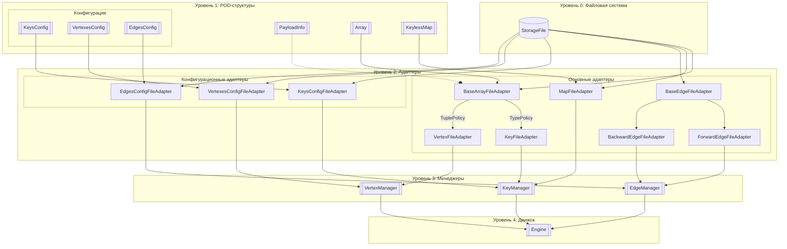
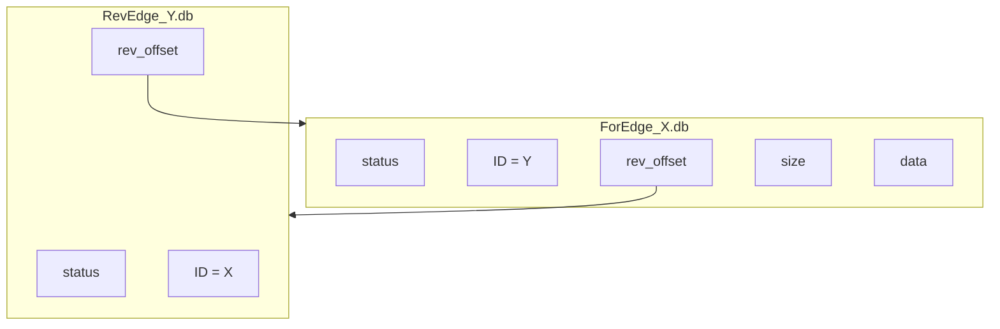
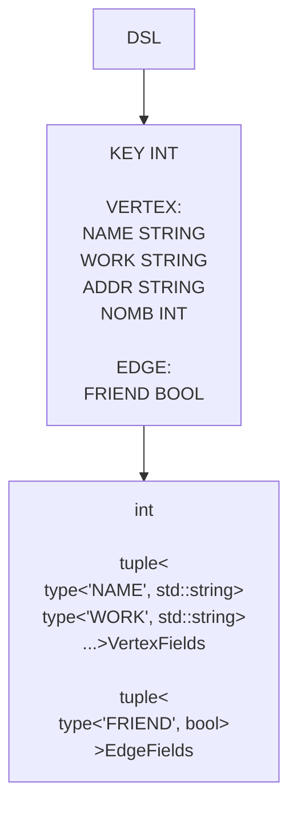

## Структура файлов графа
| Путь                    | Тип       | Содержимое                                                                 |
|-------------------------|-----------|----------------------------------------------------------------------------|
| `/` (имя графа)         |           |                                                                            |
| ├─ `graph.cpp`          | Код       | Сгенерированные типы (NamedType) + вызовы Engine API                       |
| ├─ `graph.out`          | Бинарник  | Скомпилированный движок                                                    |
| ├─ `KeyConfig.cfg`      | Конфиг    | Вспомогательная информация                                                 |
| ├─ `VertexesConfig.cfg` | Конфиг    | Вспомогательная информация                                                 |
| ├─ `EdgesConfig.cfg`    | Конфиг    | Вспомогательная информация                                                 |
| ├─ `maps/`              | Папка     |                                                                            |
| │  └─ `map_<id>.db`     | Данные    | Сериализованные ключи                                                      |
| ├─ `keys/`              | Папка     |                                                                            |
| │  └─ `key_<id>.db`     | Данные    | Сериализованные ключи                                                      |
| ├─ `vertexes/`          | Папка     |                                                                            |
| │  └─ `vertex_<id>.db`  | Данные    | Сериализованные узлы                                                       |
| ├─ `edges/`             | Папка     |                                                                            |
| │  ├─ `for_edge_<X>.db` | Данные    | Сериализованные ребра                                                      |
| │  └─ `rev_edge_<Y>.db` | Данные    | Вспомогательное информация                                                 |

## Уровни абстракции движка

## Структура ключей
### Отображение Key -> ID
Отображение происходит посредством keyless мап-ы. keyless означает, что мапа не хранит в себе ключей, а только значения. Подразумевается, что значения мапы как-то связаны с ключами. Поэтому для любых манипуляций с мапой её нужно передать ключ, хэшфункцию, значения, предикат. Предикат получается ключ (входной) и значение (которое обрабатывается) и уже работает с ним, в нашем случае возвращает true или false на равенство. Используется мапа с открытой адресацией на квадратичных числах (на алгосах было проверено, что она самая быстрая, даже лучше идеального хэширования).
### Отображение ID -> key
Это отображение тоже приходится хранить, намного выше гибкость и в некоторых местах это необходимо. Просто массивчик, такой же как в структуре узлов, только хранит он не дату, а сериализованные ключи.

## Структура узлов
```
┌──────────┬──────┬────────────┐
│   OFF_1  │ .... │    OFF_N   │  
└──────────┴──────┴────────────┘
    |                   |
    |                   |
  DATA                DATA
```
Просто есть массив фиксированного размера с файловыми смещениями. Под этими смещениями хранятся данные узлов.

## Структура ребер

```
ForEdge_X.db (прямые рёбра):
┌──────────┬──────┬────────────┬──────────┬────────────┐
│ status   │ ID   │ rev_offset │ size     │ data       │  # Данные ребра
└──────────┴──────┴────────────┴──────────┴────────────┘
RevEdge_Y.db (обратные рёбра):
┌──────────┬──────┬────────────┐
│ status   │ ID   │ for_offset │  # Только ссылка на прямое ребро
└──────────┴──────┴────────────┘
```

То есть есть для каждого узла есть два файла: с прямыми и обратными ребрами, эти ребра хранятся как список бакетов описанных выше. Причем прямые и обратные ребра знают друг о други так как хранят симметричные ID и расположение друг друга в файле. Благодоря этому удаление узла проходит легко, мне знаем сразу все исходяще и входящие ребра. Правда есть проблема, модификация и удаление конкретного ребра может быть долгой. Единственный выход - добавить ещё мапы ребер. Сделаем это как дополнительно оптимизацию, когда количество ребер становится слишком большим.
## Формат Типов
В качестве ключа поддерживаются типы: `int`, `bool`, `string`.

(типы легко масштабируются, чтобы добавить новый тип просто нужно прописать сериализацию/десериализацию для него и всё).

В качестве значений узлов или ребер можно использовать структуры произвольного размера (ниже приведены примеры). В этих структурах можно использовать любые поддерживаемые типы. Имена должны быть уникальны (но имя внутри типов узлов может совпадать с именем внутри типа ребер (т.е. поддерживается манглирование)).
